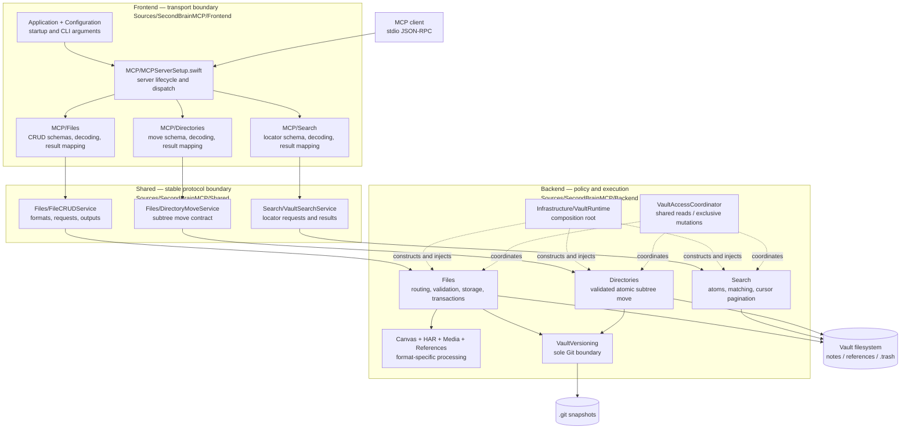
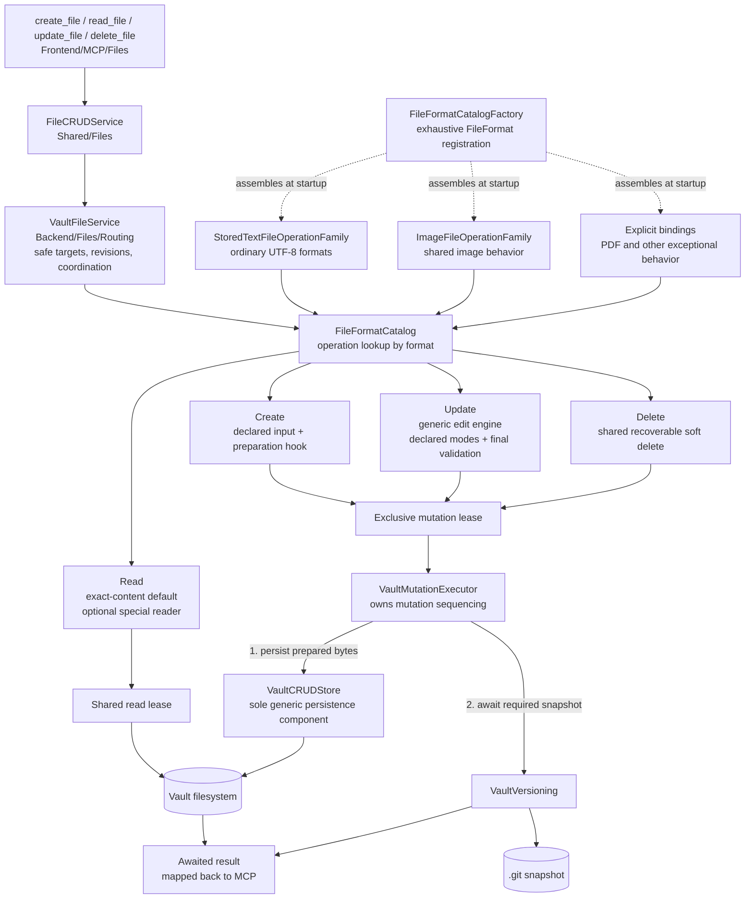

# SecondBrainMCP

A local MCP server in Swift that gives MCP clients locator-only content search plus a format-aware CRUD API for a knowledge vault. Files under `notes/` are writable; `references/` remains structurally read-only. Successful note changes await a recoverable Git snapshot, and snapshot failures are surfaced explicitly.

```
stdio-capable MCP client ──> SecondBrainMCP
                                  |
                                  +── notes/       (supported files, read/write, git tracked)
                                  +── references/  (supported files, read-only)
```

## Features

- **Compact file and directory tools** — four format-aware file CRUD tools plus one atomic `move_directory` operation for complete note subtrees
- **Locator-only vault search** — `search_vault` searches content but returns only note/file paths or physical PDF page numbers for follow-up with `read_file`
- **Concrete format routing** — Markdown, Canvas, JSON, CSV, HAR, patch/diff, log, common images, and PDF, each with explicitly registered operations
- **Multi-agent-safe vault access** — concurrent reads overlap, complete mutations are exclusive through their Git snapshot, and exact-byte revisions reject stale updates and deletes
- **Git snapshots** — note changes request a local `Vault snapshot`; concurrent agents may share one recovery point, and `references/` is never included
- **Soft deletes** — deleted files move to `.trash/`, never permanently removed
- **Atomic PDF page reading** — each requested physical page returns bounded extracted text plus a PNG image; single pages, ordered page sets, and inclusive ranges are supported
- **Read-only mode** — `--read-only` hides write tools and disables vault migration/Git mutation in the backend
- **Path security** — symlink resolution, traversal prevention, extension allowlists
- **Works alongside Obsidian, iA Writer, Logseq** — the vault is plain Markdown; app config directories are ignored
- **Custom instructions** — drop an `INSTRUCTIONS.md` in your vault root to define your own conventions

## Quick Start

```bash
# 1. Build
swift build -c release
# Binary is at .build/release/second-brain-mcp

# 2. Create a vault
./setup-vault.sh

# 3. Connect to Claude or Codex (see below)

# 4. Ask your MCP client: "What notes do I have?"
```

## Requirements

- Swift 6.2 or later (builds on 6.4 — note the [build-output path change](#installation) on 6.4+)
- macOS 26 (Tahoe) or later
- Xcode 26 or later

## Installation

```bash
git clone https://github.com/yourusername/SecondBrainMCP.git
cd SecondBrainMCP
swift build -c release
```

The binary is at `.build/release/second-brain-mcp`. You can copy it anywhere:

```bash
cp .build/release/second-brain-mcp /usr/local/bin/
```

> **Always use the `.build/release/second-brain-mcp` path — not an architecture-specific one** like `.build/arm64-apple-macosx/release/second-brain-mcp`. Swift 6.4 changed SwiftPM's default build system from `native` (which wrote products to `.build/<triple>/release/`) to `swiftbuild` (which writes to `.build/out/Products/Release/`). SwiftPM keeps `.build/release` and `.build/debug` as symlinks to the current layout under **both** systems, so pinning to the symlink survives toolchain upgrades. Pinning to an arch-specific path will silently keep launching a **stale binary** after you upgrade Swift — the build succeeds, but lands somewhere your config no longer points to.

## Connecting to Claude and Codex

SecondBrainMCP uses the standard stdio MCP transport. The examples below configure Claude Desktop,
Claude Code, and Codex. Another MCP client can use the same executable and arguments when it supports
launching local stdio servers.

### Option A: Claude Desktop (the macOS app)

Edit `~/Library/Application Support/Claude/claude_desktop_config.json`:

```json
{
  "mcpServers": {
    "second-brain": {
      "command": "/absolute/path/to/.build/release/second-brain-mcp",
      "args": ["--vault", "/absolute/path/to/your/vault"]
    }
  }
}
```

**Restart Claude Desktop after saving** (Cmd+Q, then reopen). The server starts automatically when Claude needs it. Verify by asking Claude *"What tools do you have?"* — you should see the SecondBrainMCP tools.

### Option B: Claude Code (the CLI)

```bash
claude mcp add second-brain -- \
  /absolute/path/to/.build/release/second-brain-mcp \
  --vault /absolute/path/to/your/vault
```

This registers the server globally. It's available immediately in new `claude` sessions — no restart needed.

To scope it to a specific project instead, use `-s project`:

```bash
claude mcp add -s project second-brain -- \
  /absolute/path/to/.build/release/second-brain-mcp \
  --vault /absolute/path/to/your/vault
```

You can also import your Claude Desktop config directly:

```bash
claude mcp add-from-claude-desktop
```

Verify with:

```bash
claude mcp list
```

### Option C: Codex (desktop app, CLI, and IDE extension)

The quickest setup uses the Codex CLI:

```bash
codex mcp add second-brain -- \
  /absolute/path/to/.build/release/second-brain-mcp \
  --vault /absolute/path/to/your/vault
```

This writes the server to the user-level Codex configuration. The Codex desktop app, CLI, and IDE
extension share that configuration, so one registration makes the server available across all three.
Verify it from a terminal or from the Codex TUI:

```bash
codex mcp list
```

```text
/mcp
```

You can also configure it from the Codex desktop app: open **Settings → MCP servers**, select
**Add server**, choose **STDIO**, enter the same executable and arguments, save, and restart Codex.
For a trusted-project-only configuration, place the equivalent server entry in
`.codex/config.toml` instead of the default `~/.codex/config.toml`. See the
[official Codex MCP documentation](https://developers.openai.com/codex/mcp/) for configuration details.

### Updating the server

After pulling changes or editing the code, rebuild and **relaunch the client** so new or changed tools are picked up:

```bash
swift build -c release
```

Then fully restart the active client: **Cmd+Q and reopen Claude Desktop or Codex**, or start a new `claude` or `codex` session. A running server keeps serving its old tool list until the process is relaunched — rebuilding alone isn't enough.

If new tools still don't appear, confirm the client's `command` points at `.build/release/second-brain-mcp` (the symlink, see [Installation](#installation)) and not a stale architecture-specific path.

## Vault Structure

```
~/SecondBrain/
├── notes/              <- Supported files (editable, git tracked)
│   ├── projects/
│   ├── journal/
│   └── artifacts/
├── references/         <- PDF/image reference library (read-only)
├── INSTRUCTIONS.md     <- Optional: custom rules for the AI (see below)
├── .git/               <- Auto-created on first run
└── .trash/             <- Soft-deleted files land here
```

Only `notes/` and `references/` need to exist. Writable startup prepares Git metadata as needed; read-only startup leaves the vault untouched.

## CLI Flags

| Flag | Default | Description |
|------|---------|-------------|
| `--vault <path>` | *(required)* | Path to your vault directory |
| `--read-only` | `false` | Expose only `read_file` and `search_vault` |

## File API

The public API has four generic file CRUD tools, one atomic directory-move tool, and one read-only search tool. File CRUD callers must provide `format`; the server then verifies that the path extension and, where applicable, the decoded/parsed content agree with that format. CRUD schemas and decoders reject unknown arguments, and `update_file` requires an explicit `mode`. Directory moves operate on the subtree path itself and therefore do not require or guess a file format.

Reads under `notes/` return an opaque exact-byte `revision`; `update_file` and `delete_file` require that value as `expected_revision`. Results carrying a revision expose the same `path`, `area`, and `revision` object in `structuredContent` and as a trailing JSON text block, so clients that do not surface structured tool output still receive the token. A conflict means another actor changed the note, so the client must read and reconsider the new content rather than blindly retry. Read-only files under `references/` do not need revisions. A mutation call returns only after its filesystem change and required Git snapshot finish. If the transport loses that response, read the target state before deciding whether another mutation is needed.

| Tool | Purpose |
|------|---------|
| `search_vault` | Locate matching whole-file atoms or physical PDF pages without returning their content |
| `create_file` | Validate/transform input, atomically create under `notes/`, and request a vault snapshot |
| `read_file` | Apply the format-specific reader for a file under `notes/` or `references/` |
| `update_file` | Apply a supported replace/append/patch operation under `notes/`, with stale-write protection |
| `delete_file` | Soft-delete a supported file under `notes/` to `.trash/`, then request a vault snapshot |
| `move_directory` | Atomically rename a complete `notes/` subtree—including nested files and directories—and request a vault snapshot |

### Directory moves

Use `move_directory` when a project or ticket folder changes lifecycle state. Supply the existing `source_path` and exact unused `destination_path`; there is no `format` argument because this is a structural operation over a set of file atoms. For example, one call can move `notes/in-progress/ticket-123` to `notes/completed/ticket-123` without returning or recreating any file content. Missing destination parents are created safely, the destination is never overwritten, moves into the source subtree are rejected, and case- or Unicode-equivalent source and destination paths are treated as the same directory. Success returns only `source_path` and `destination_path`.

The complete subtree is validated before the descriptor-based no-follow rename, so hidden/package descendants and credential-bearing files are rejected before the move. The global mutation lease remains held through the rename and Git snapshot, so cooperating reads cannot observe a half-completed operation. Pending note changes may deliberately share that snapshot. Empty directories move on the filesystem, but Git has no directory objects and therefore cannot preserve an empty directory by itself. Successful files are immediately discoverable through `search_vault` at their destination paths; search itself remains read-only.

### Search

`search_vault` is a locator, not a reader. It searches content but returns only the atomic elements that contain a match: `path` and `format` for whole-file atoms, plus the one-based physical `page` for a PDF page. Use those values with `read_file` to retrieve the content.

Every request selects exactly one `location`: `notes` or `references`. It must also supply at least one search criterion: a text `query`, one or more `tags`, `created_from`, or `created_through`. Tags and created-date filters apply only to Markdown notes. Literal text matching is case-, diacritic-, and width-insensitive; every whitespace-separated query term must occur in the same atom. Exact phrases and repeated occurrences only determine stable result order.

Readable textual formats automatically participate without a search-specific format registry. Markdown notes are one atom each and expose their shared frontmatter `created` date and tags to metadata filters. JSON, CSV, HAR, Canvas, patch/diff, and log files are each searched as one whole-file atom. A format that needs a different representation can register a search atom provider without changing the public search contract. A malformed, oversized, unreadable, or concurrently replaced individual file is omitted from that search rather than making every healthy file in the selected area undiscoverable; cancellation and path-validation failures still abort the request.

PDF references are represented as one atom per physical page. Page text is cached by exact file revision under the vault's private `~/Library/Application Support/SecondBrainMCP/` data directory, never inside the vault or Git. Embedded PDF text is preferred; pages without embedded text use Vision OCR. Search returns only the matching page number. `read_file(format: pdf)` retrieves physical pages with exactly one text block and one bounded PNG image per page, preserving diagrams and non-text content for the model. Select one page with `page`, an ordered set with `pages`, or an inclusive range such as `page_range: "7-10"`; the selectors are mutually exclusive, default to page 1, and are capped at 20 pages per call.

`limit` defaults to 20 and is capped at 50. When `next_cursor` is present, repeat the identical criteria with that cursor; for an unchanged vault, every matching atom remains reachable until a response omits `next_cursor`. The cursor is bound to both the request and a deterministic fingerprint of the searchable corpus. If the vault changes between pages, the cursor is rejected as stale instead of silently skipping a result; restart the search from its first page.

Search results contain no snippets, file content, scores, diagnostics, or mutation revisions. Search discovers where information lives; `read_file` retrieves it and supplies the revision required for a later note update or delete.


### Formats and operations

| Format | Extensions | Create | Read | Update | Delete |
|--------|------------|:------:|:----:|:------:|:------:|
| `markdown` | `.md`, `.markdown` | notes | notes | replace/append/patch | notes |
| `canvas` | `.canvas` | notes | notes | replace | notes |
| `har` | `.har` | notes | notes | — | notes |
| `patch` | `.patch`, `.diff` | notes | notes | — | notes |
| `log` | `.log` | notes | notes | append | notes |
| `json` | `.json` | notes | notes | replace/patch | notes |
| `csv` | `.csv` | notes | notes | replace/append/patch | notes |
| `png` | `.png` | external image → clean/resized PNG | notes, references | — | notes |
| `gif` | `.gif` | external video + `video_to_gif` | notes, references | — | notes |
| `jpeg`, `webp`, `heic`, `tiff`, `bmp` | native aliases | — | notes, references | — | notes |
| `pdf` | `.pdf` | — | references | — | — |

The matrix and each format's create input and update modes come from one exhaustive backend catalog. MCP tool discovery projects that contract directly into the four CRUD schemas, and `VaultFileService` enforces the same create contract before dispatch, so advertised and accepted inputs cannot drift. Adding a format does not require a resource or a second frontend registry. Internal handler identities stay private. In `--read-only` mode, mutating tools disappear from discovery.

Format-specific CRUD behavior stays behind the four endpoints:

- HAR input must have a valid, duplicate-key-free HAR `log` structure. Authorization/cookie headers, cookies, URL user information, authentication parameters, and credential fields in JSON/form request bodies are redacted before Git persistence; reads return the complete sanitized HAR JSON as one atomic document.
- Git-tracked text writes reject high-confidence bearer, session, JWT, and provider-token patterns before persistence. Diagnostics identify the detector and line without repeating the credential; explicit redaction and documentation placeholders remain valid.
- Patch input must be a unified diff; reads return the complete validated diff as one atomic document.
- Logs default to the last 500 lines, support bounded line ranges, and can only be appended.
- JSON accepts any valid top-level JSON value, preserves its original representation, and validates replacements or exact text patches before persistence.
- CSV supports quoted fields, escaped quotes, embedded line breaks, and consistent column counts; every update validates the complete resulting table.
- Canvas input is structurally validated without re-serializing it, so extension/plugin keys survive.
- Images are decoded before import; PNG creation strips metadata/trailing payloads and caps the stored long edge. Animated GIF reads return sampled timed frames.
- PDF reads return exactly bounded text plus a PNG image for each selected physical page. `page`, `pages`, and `page_range` provide single-page, ordered-set, and inclusive-range retrieval; content queries belong to `search_vault`.

## Custom Instructions

Drop an `INSTRUCTIONS.md` file in your vault root to define conventions the AI should follow when managing your notes. For example:

```markdown
VAULT RULES:
1. Always create notes inside a container directory — never as loose files.
2. Every note must have YAML frontmatter with title, created date, and tags.
3. Ticket notes should start with the ticket ID.
```

The server appends the file contents to its default instructions during startup. If the file doesn't exist, only the built-in defaults are sent. No rebuild required — just create or edit the file and restart the MCP server.

## Security

- **Path traversal prevention** — all paths validated through `PathValidator` with symlink resolution
- **No caller-selected commands** — only `/usr/bin/git`, with programmatic argument arrays
- **Structural write boundaries** — `WritableFileTarget` cannot represent a path under `references/`
- **Soft deletes only** — files are never permanently deleted
- **Commit message sanitization** — shell metacharacters stripped from git messages

See [SECURITY.md](SECURITY.md) for the full threat model, network-activity audit, dependency tree, and how to verify it all yourself.

## Architecture

```
Sources/SecondBrainMCP/
├── Frontend/                           # Public CLI and MCP API boundary
│   ├── Application/main.swift
│   ├── Configuration/                  # Argument parsing
│   └── MCP/
│       ├── MCPServerSetup.swift        # Transport lifecycle and tool dispatch
│       ├── Directories/                # Atomic subtree-move adapter
│       ├── Files/                      # Four catalog-derived generic CRUD tools
│       └── Search/                     # Locator-only search schema and adapter
├── Backend/                            # Internal behavior; never imports MCP
│   ├── Infrastructure/VaultRuntime.swift # Composition root and dependency injection
│   ├── Concurrency/                    # Reusable gates and vault access coordination
│   ├── Directories/                    # Validated atomic subtree movement
│   ├── Files/
│   │   ├── Ingress/                    # Stored-text request-to-bytes policy
│   │   ├── Operations/                 # Format-specific validation/transformation
│   │   ├── Routing/                    # Catalog, operation families, routed service
│   │   ├── Storage/                    # Generic snapshots, persistence, soft deletion
│   │   ├── Targets/                    # Validated readable/writable vault paths
│   │   ├── Transactions/               # Prepared persistence and Git sequencing
│   │   └── Validation/                 # Vault and external-source security
│   ├── Search/                         # Atom providers, literal matching, pagination
│   ├── VaultVersioning/                # Sole Git subprocess boundary
│   └── Canvas/, HAR/, Media/, References/ # Specialized format processing
└── Shared/                             # Cross-boundary values and small utilities
    ├── Files/                          # File CRUD and directory-move contracts
    ├── Search/                         # Search request/result/service contracts
    ├── References/                     # Shared PDF navigation values
    └── Logging/                        # Shared stderr logger
```

### Layer and protocol boundaries

Solid arrows show runtime requests and data flow. Dashed arrows show composition or shared
coordination. The Shared nodes are protocols and values, not another orchestration layer.



The boundary rule is simple: Frontend understands MCP but not vault policy; Shared defines the
plain Swift contracts both sides agree on; Backend implements those contracts and owns all vault
behavior. Search and directory moves use their own protocols because neither operation is atomic
file CRUD.

### Catalog-driven CRUD

All four public file tools share one frontend pipeline. The backend catalog is the only place that
decides which operations and format-specific hooks exist.



The operation families supply the common behavior. A catalog case declares only what differs:
creation validation or transformation, an exceptional read, allowed update modes, final-content
validation, or specialized append semantics. Delete is destructive but generic; HAR and log reads
are non-mutating but specialized. This is why specialization follows format policy rather than a
simple read-versus-write split.

Dependencies flow inward as `Frontend → Backend → Shared`. Frontend translates CLI/MCP
inputs into plain Swift values. Backend owns vault behavior, routing, processing, and persistence.
Shared contains only stable contracts or genuinely cross-boundary utilities; feature orchestration
does not belong there. Backend and Shared never depend on Frontend.

`VaultRuntime` is the backend composition root. `FileFormatDefinition` is the wiring point: each
concrete format registers only the operations it supports and binds those operations to reusable
functions. `VaultFileService` validates registered create contracts, routes requests, and supplies
read handlers with one immutable byte snapshot used for both content and revision. `TextFileIngress`
converts stored-text create requests into bounded inline bytes before their semantic handler; and
`VaultMutationExecutor` performs the prepared persistence and awaits any required vault snapshot.
Format handlers never load external text sources or write vault files; `VaultCRUDStore` is the sole
persistence component for the generic API. Writable targets cannot represent `references/`.

**Concurrency model:** one `VaultAccessCoordinator` is created per `VaultRuntime` and injected
through the `VaultAccessCoordinating` protocol. Shared leases let reads overlap. A mutation waits
for existing reads, then holds the exclusive lease through validation, preparation, filesystem
persistence, and Git snapshot. Once a mutation is queued, later reads wait behind it. Independent
MCP processes use shared/exclusive modes on the same advisory lock file. OS scheduling does not
promise strict FIFO ordering between separate processes, so mixed old/new hosts must be fully
restarted after an upgrade.

Queued cancellation performs no mutation. Cancellation is checked again before prepared persistence
starts; once persistence starts, the persistence-and-snapshot chain finishes before the exclusive
lease is released. Exact-byte revisions reject stale cooperating edits, and the store rechecks bytes
immediately before persistence. Applications that ignore the MCP lock can still write inside the
final compare-to-rename window because filesystem path replacement has no universal cross-application
compare-and-swap. If a response is lost, callers must read the target and decide from its current
state whether another mutation is necessary.
