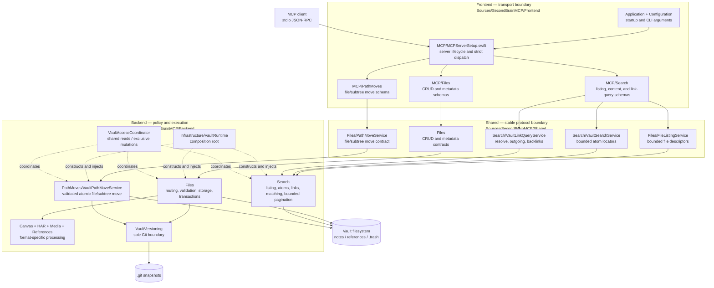
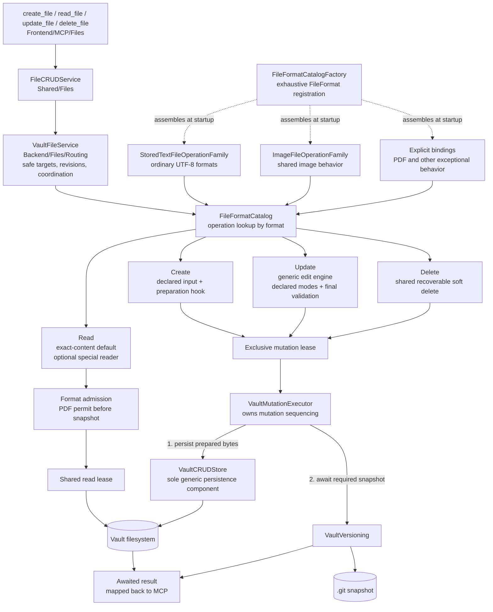

# SecondBrainMCP

A local MCP server in Swift that gives MCP clients bounded file discovery, locator-only content and link queries, plus a format-aware CRUD API for a knowledge vault. Files under `notes/` are writable; `references/` remains structurally read-only. Successful note changes await a recoverable Git snapshot, and snapshot failures are surfaced explicitly.

```
stdio-capable MCP client ──> SecondBrainMCP
                                  |
                                  +── notes/       (supported files, read/write, git tracked)
                                  +── references/  (supported files, read-only)
```

## Features

- **Eight composable agent tools** — file discovery, content search, link traversal, four format-aware CRUD operations, and one atomic file-or-directory `move_path`
- **Content-free discovery** — `list_files`, `search_vault`, and `query_links` return bounded structured locators instead of dumping file contents
- **Metadata views** — `read_file(view: metadata)` returns bounded Markdown or PDF facts without page text, images, or document bodies
- **Concrete format routing** — Markdown, Canvas, JSON, CSV, HAR, patch/diff, log, common images, and PDF, each with explicitly registered operations
- **Bounded text reads** — UTF-8 documents default to 64 KiB revision-guarded chunks with explicit continuation metadata; no silent truncation or split Unicode scalars
- **Multi-agent-safe vault access** — concurrent reads overlap, complete mutations are exclusive through their Git snapshot, and exact-byte revisions reject stale updates and deletes
- **Git snapshots** — note changes request a local `Vault snapshot`; concurrent agents may share one recovery point, and `references/` is never included
- **Soft deletes** — deleted files move to `.trash/`, never permanently removed; parent directories and their unrelated contents are preserved
- **Atomic PDF page reading** — each requested physical page returns bounded extracted text plus a PNG image; single pages, ordered page sets, and inclusive ranges are supported
- **Read-only mode** — `--read-only` hides write tools and disables vault migration/Git mutation in the backend
- **Path security** — symlink resolution, traversal prevention, extension allowlists
- **Works alongside Obsidian, iA Writer, Logseq** — the vault is plain Markdown; app config directories are ignored
- **Custom instructions** — drop an `INSTRUCTIONS.md` in your vault root to define your own conventions

## Quick Start

```bash
# 1. Build
swift build -c release
# Binary is at .build/release/second-brain-mcp

# 2. Create a vault
./setup-vault.sh

# 3. Connect to Claude or Codex (see below)

# 4. Ask your MCP client: "What notes do I have?"
```

## Requirements

- Swift 6.3 or later (builds on 6.4 — note the [build-output path change](#installation) on 6.4+)
- macOS 26 (Tahoe) or later
- Xcode 26 or later

## Installation

```bash
git clone https://github.com/bitbemol/second-brain-mcp.git
cd second-brain-mcp
swift build -c release
```

The binary is at `.build/release/second-brain-mcp`. You can copy it anywhere:

```bash
cp .build/release/second-brain-mcp /usr/local/bin/
```

> **Always use the `.build/release/second-brain-mcp` path — not an architecture-specific one** like `.build/arm64-apple-macosx/release/second-brain-mcp`. Swift 6.4 changed SwiftPM's default build system from `native` (which wrote products to `.build/<triple>/release/`) to `swiftbuild` (which writes to `.build/out/Products/Release/`). SwiftPM keeps `.build/release` and `.build/debug` as symlinks to the current layout under **both** systems, so pinning to the symlink survives toolchain upgrades. Pinning to an arch-specific path will silently keep launching a **stale binary** after you upgrade Swift — the build succeeds, but lands somewhere your config no longer points to.

## Connecting to Claude and Codex

SecondBrainMCP uses the standard stdio MCP transport. The examples below configure Claude Desktop,
Claude Code, and Codex. Another MCP client can use the same executable and arguments when it supports
launching local stdio servers. Concurrent responses remain complete newline-delimited frames, and
input is read on demand. Incoming frames above 192 MiB or incomplete frames at EOF terminate the
connection. After any lost mutation response, observe the current state before retrying.

### Option A: Claude Desktop (the macOS app)

Edit `~/Library/Application Support/Claude/claude_desktop_config.json`:

```json
{
  "mcpServers": {
    "second-brain": {
      "command": "/absolute/path/to/.build/release/second-brain-mcp",
      "args": ["--vault", "/absolute/path/to/your/vault"]
    }
  }
}
```

**Restart Claude Desktop after saving** (Cmd+Q, then reopen). The server starts automatically when Claude needs it. Verify by asking Claude *"What tools do you have?"* — you should see the SecondBrainMCP tools.

### Option B: Claude Code (the CLI)

```bash
claude mcp add second-brain -- \
  /absolute/path/to/.build/release/second-brain-mcp \
  --vault /absolute/path/to/your/vault
```

This registers the server globally. It's available immediately in new `claude` sessions — no restart needed.

To scope it to a specific project instead, use `-s project`:

```bash
claude mcp add -s project second-brain -- \
  /absolute/path/to/.build/release/second-brain-mcp \
  --vault /absolute/path/to/your/vault
```

You can also import your Claude Desktop config directly:

```bash
claude mcp add-from-claude-desktop
```

Verify with:

```bash
claude mcp list
```

### Option C: Codex (desktop app, CLI, and IDE extension)

The quickest setup uses the Codex CLI:

```bash
codex mcp add second-brain -- \
  /absolute/path/to/.build/release/second-brain-mcp \
  --vault /absolute/path/to/your/vault
```

This writes the server to the user-level Codex configuration. The Codex desktop app, CLI, and IDE
extension share that configuration, so one registration makes the server available across all three.
Verify it from a terminal or from the Codex TUI:

```bash
codex mcp list
```

```text
/mcp
```

You can also configure it from the Codex desktop app: open **Settings → MCP servers**, select
**Add server**, choose **STDIO**, enter the same executable and arguments, save, and restart Codex.
For a trusted-project-only configuration, place the equivalent server entry in
`.codex/config.toml` instead of the default `~/.codex/config.toml`. See the
[official Codex MCP documentation](https://developers.openai.com/codex/mcp/) for configuration details.

### Updating the server

After pulling changes or editing the code, rebuild and **relaunch the client** so new or changed tools are picked up:

```bash
swift build -c release
```

Then fully restart the active client: **Cmd+Q and reopen Claude Desktop or Codex**, or start a new `claude` or `codex` session. A running server keeps serving its old tool list until the process is relaunched — rebuilding alone isn't enough.

If new tools still don't appear, confirm the client's `command` points at `.build/release/second-brain-mcp` (the symlink, see [Installation](#installation)) and not a stale architecture-specific path.

## Vault Structure

```
~/SecondBrain/
├── notes/              <- Supported files (editable, git tracked)
│   ├── projects/
│   ├── journal/
│   └── artifacts/
├── references/         <- PDF/image reference library (read-only)
├── INSTRUCTIONS.md     <- Optional: custom rules for the AI (see below)
├── .git/               <- Auto-created on first run
└── .trash/             <- Soft-deleted files land here
```

Only `notes/` and `references/` need to exist. Writable startup connects the MCP transport before recovering pending note changes into Git, so initialization and tool discovery do not wait behind a large or contended snapshot. Mutating tool calls remain gated until that recovery finishes; reads are accepted immediately but may wait on the vault's shared/exclusive access lease while recovery holds it. If recovery fails after connection, the server stays connected for discovery and reads while every mutation reports the recovery error instead of terminating the process; restart after correcting the Git or storage failure. Recovery and transport completion are logged to stderr. On input EOF, the server closes tool admission, cancels outstanding calls and waits for their work to unwind; persistence that has already started still finishes its required Git snapshot. This does not protect against forced process termination. Read-only startup leaves the vault untouched.

## CLI Flags

| Flag | Default | Description |
|------|---------|-------------|
| `--vault <path>` | *(required)* | Path to your vault directory |
| `--read-only` | `false` | Expose only `list_files`, `search_vault`, `query_links`, and `read_file` |

## File API

The public API has eight composable tools: three bounded discovery/query tools, four generic file CRUD tools, and one atomic file-or-directory move. File CRUD callers provide `format`; the server verifies that the extension and, where applicable, decoded content agree. Schemas reject unknown arguments, `update_file` requires an explicit `mode`, and mutations of existing files require a revision read from the exact source bytes. Directory moves remain structural and therefore omit file-only fields.

Upgrading from v0.7.1 is a breaking API migration; see [Migrating from v0.7.1 to v2](MIGRATION-v2.md) for capability mappings, removed resources, new behavior, and restart guidance.

Reads under `notes/` return an opaque exact-byte `revision`; `update_file`, `delete_file`, and file-form `move_path` require that value as `expected_revision`. UTF-8 Markdown, Canvas, HAR, patch, JSON, and CSV reads return at most 64 KiB by default and include `text_window` in structured output and the trailing JSON metadata block. When `next_byte_offset` is present, continue with that value as `byte_offset` and the same revision as `expected_revision`; a changed file is rejected instead of mixing chunks from different versions. Callers may select `max_bytes` from 4 bytes through 256 KiB, and chunk boundaries never split a UTF-8 scalar. Read-only files under `references/` do not need revisions. A mutation call returns only after its filesystem change and required Git snapshot finish. If the transport loses that response, read the target state before deciding whether another mutation is needed.

| Tool | Purpose |
|------|---------|
| `list_files` | Browse paths and lightweight filesystem metadata without search terms or content reads |
| `search_vault` | Locate matching file, PDF-page, or Canvas-node atoms without returning their content |
| `query_links` | Resolve wiki targets or traverse local wiki/inline Markdown links and grouped backlinks without snippets |
| `create_file` | Validate/transform input, atomically create under `notes/`, and request a vault snapshot |
| `read_file` | Read bounded content or a content-free Markdown/PDF metadata view |
| `update_file` | Apply a supported replace/append/patch operation under `notes/`, with stale-write protection |
| `delete_file` | Soft-delete a supported file under `notes/` to `.trash/`, then request a vault snapshot |
| `move_path` | Atomically rename one revision-guarded supported file or one complete `notes/` subtree |

### Path moves

Use `move_path` instead of a read-create-delete sequence when an existing file or project subtree changes location. For `kind: file`, provide the source's concrete `format` and exact `expected_revision` returned by `read_file`; the source and destination extensions must match. For `kind: directory`, omit those file-only fields. Supply the existing `source_path` and exact unused `destination_path`. Missing destination parents are created safely, destinations are never overwritten, moves into the source subtree are rejected, and case- or Unicode-equivalent paths are treated as identical. Success returns only `source_path` and `destination_path`.

The selected file or complete subtree is validated before the descriptor-based no-follow rename, so unsupported, hidden/package, symlinked, stale, or credential-bearing content is rejected before the move. The global mutation lease remains held through the rename and Git snapshot, so cooperating reads cannot observe a half-completed operation. Pending note changes may deliberately share that snapshot. Empty directories move on the filesystem, but Git has no directory objects and therefore cannot preserve an empty directory by itself. Successful files are immediately discoverable through `search_vault` at their destination paths; search itself remains read-only.

### File discovery

Use `list_files` when the goal is to inspect what exists rather than match content. Select one `area` (`notes` or `references`), then optionally narrow with an area-relative `directory`, `recursive: false`, or concrete `formats`. Results contain only canonical path, format, byte count, and modified time; the tool does not open document bodies. Listing, content search and link queries skip hidden entries and nested package directories (such as application bundles); explicitly selecting a package as a discovery scope is rejected. This discovery policy does not change direct access to an explicitly named, valid readable file. Pages default to 100 entries and are capped at 500. Continue an unchanged request with `next_cursor`; if matching files change, restart without the stale cursor.

### Link queries

Use `query_links` when the relationship is known. `direction: resolve` maps a wiki `target` to matching supported paths and marks ambiguity; optional `from_path` ranks nearby candidates first. `direction: outgoing` takes the source `notes/...md` path in `target`. `direction: backlinks` defaults to one source/target pair with `occurrence_count`, avoiding repeated copies of the same note. To inspect a group, use `group_by: occurrence` and `source_path`. Resolved entries include `resolved_format` for a subsequent `read_file` call. Grouping and source filters apply only to backlinks.

Outgoing links and backlinks recognize wiki links/embeds and inline Markdown links/images. Inline destinations resolve relative to their source, with URI decoding once; wiki destinations use vault/proximity rules. Fragments, aliases, ambiguity and unresolved local targets remain structured. Escapes, fenced/inline code and external URLs are excluded; reference-style Markdown is not supported. Metadata targets are raw identifiers, not necessarily read-ready paths: use an outgoing query on their source to resolve them.

Results contain no snippets or bodies. Every page includes `coverage`: `complete: false` means some eligible sources failed, not that their links are absent. `next_cursor` pages already examined results, independently of coverage. Continue with unchanged semantic criteria; `limit` may change. Content or relevant path-namespace changes invalidate a cursor.

### Search

`search_vault` is a locator, not a reader. It searches content but returns only atomic coordinates: `path` and `format` for whole-file atoms, one-based physical `page` for PDF pages, or `canvas_node_id` plus `canvas_field` for a searchable Canvas node field. Use the path and format with `read_file` to retrieve content.

Every request selects exactly one `location`: `notes` or `references`. Optional area-relative `directory` and concrete `formats` narrow eligibility before content is opened. It must also supply at least one search criterion: a text `query`, one or more `tags`, `created_from`, or `created_through`. Tags and created-date filters apply only to Markdown notes. Literal text matching is case-, diacritic-, and width-insensitive; every whitespace-separated query term must occur in the same atom. Exact phrases and repeated occurrences only determine stable result order.

Readable textual formats automatically participate without a search-specific format registry. Markdown notes are one atom each and expose their shared frontmatter `created` date and tags to metadata filters. JSON, CSV, HAR, patch/diff, and log files are each searched as one raw UTF-8 whole-file atom; search does not validate their format-specific syntax. `coverage.complete` describes examination of the search representation, not certification that a later strict `read_file` will accept every stored document. Canvas is searched as bounded node-field atoms so a result identifies the exact node ID and field instead of returning the entire JSON document as one match. A format that needs a different representation can register a search atom provider without changing the public search contract. An individual file that cannot be decoded into its search representation, exceeds its limits, is unreadable, or changes during capture contributes no partial matches and makes `coverage.complete` false. Coverage includes an exact `failed_files` count and at most three whole-path/category samples within 2 KiB; `samples_truncated` reports omitted samples. Empty incomplete results cannot establish absence. Unknown traversal failures, path-policy failures, cancellation and request-level resource exhaustion fail the entire request.

Search permits up to 10,000 eligible files, 100,000 scanned entries, 256 MiB of attempted source bytes and 100,000 atoms. Per-format file and extraction limits still apply. Separate 8 MiB budgets bound traversal path strings and each retained candidate/capture manifest. It captures immutable inputs under the cooperating-vault read lease, then releases that lease before extraction and ranking; it does not retain the entire corpus in memory. Capture storage is private, outside the vault/Git, bounded and cleaned after use. Lowering result `limit` does not reduce scan work: narrow `directory`, `formats` or the searched area instead. A warm query still reconciles exact source bytes; caching is not permission to serve stale results.

PDF references are represented as one atom per physical page. Page text is cached in immutable, integrity-checked generations by exact file revision under the vault's private `~/Library/Application Support/SecondBrainMCP/` data directory, never inside the vault or Git. Cache failures fall back to bounded extraction; cache publication is best-effort and never part of mutation durability. Extraction rejects a page above 2 MiB or document text above 64 MiB instead of silently truncating it. Embedded PDF text is preferred; pages without embedded text use Vision OCR. OCR is approximate, so complete search coverage does not guarantee exact recognition of every printed word; inspect the rendered physical page when that distinction matters. Search OCR uses CPU execution where Vision advertises support, with accurate recognition and language correction unchanged. Cancellation is cooperative and the shared PDF permit remains held until the awaited call returns, so other PDF operations may wait; there is no universal native-time deadline. The [validation record](Benchmarks/V2-VALIDATION.md) separates measured cancellation recovery, first-scan cost, cache reuse and remaining client qualification. Search returns only the matching page number. `read_file(format: pdf)` retrieves physical pages with exactly one text block and one bounded PNG image per page, preserving diagrams and non-text content for the model. Select one page with `page`, an ordered set with `pages`, or an inclusive range such as `page_range: "7-10"`; the selectors are mutually exclusive, default to page 1, and are capped at 20 pages per call.

`limit` defaults to 20 and is capped at 50. When `next_cursor` is present, repeat the same semantic criteria with that cursor (`limit` may change); every match from successfully examined content remains reachable until a response omits `next_cursor`. Coverage is repeated on every page and is independent of pagination. The cursor is bound to both the request and a deterministic fingerprint of the searchable corpus. If the vault changes between pages, the cursor is rejected as stale instead of silently skipping a result; restart the search from its first page.

Search locators contain no snippets, file content, scores or mutation revisions; bounded coverage categories describe isolated failures separately. Each complete encoded locator is limited to 4 KiB. If any locator in a source exceeds that ceiling, the source contributes no partial results and is reported as incomplete `file_limit` coverage; identifiers are never clipped. This discovery bound does not invalidate stored Canvas IDs or direct read selectors. Structured search output is capped at 256 KiB. Search discovers where information lives; `read_file` retrieves it and supplies the revision required for a later note update or delete.


### Formats and operations

| Format | Extensions | Create | Read | Update | Delete |
|--------|------------|:------:|:----:|:------:|:------:|
| `markdown` | `.md`, `.markdown` | notes | notes | replace/append/patch | notes |
| `canvas` | `.canvas` | notes | notes | replace | notes |
| `har` | `.har` | notes | notes | — | notes |
| `patch` | `.patch`, `.diff` | notes | notes | — | notes |
| `log` | `.log` | notes | notes | append | notes |
| `json` | `.json` | notes | notes | replace/patch | notes |
| `csv` | `.csv` | notes | notes | replace/append/patch | notes |
| `png` | `.png` | external image → clean/resized PNG | notes, references | — | notes |
| `gif` | `.gif` | external video + `video_to_gif` | notes, references | — | notes |
| `jpeg`, `webp`, `heic`, `tiff`, `bmp` | native aliases | — | notes, references | — | notes |
| `pdf` | `.pdf` | — | references | — | — |

The matrix and each format's create input and update modes come from one exhaustive backend catalog. MCP tool discovery projects that contract directly into the four CRUD schemas, and `VaultFileService` enforces the same create contract before dispatch, so advertised and accepted inputs cannot drift. Adding a format does not require a resource or a second frontend registry. Internal handler identities stay private. In `--read-only` mode, mutating tools disappear from discovery.

Format-specific CRUD behavior stays behind the four endpoints:

- HAR input must have a valid, duplicate-key-free HAR `log` structure. Authorization/cookie headers, cookies, URL user information, authentication parameters, and credential fields in JSON/form request bodies are redacted before Git persistence; reads validate the complete sanitized archive before returning a bounded text chunk.
- Git-tracked text writes reject high-confidence bearer, session, JWT, and provider-token patterns before persistence. Diagnostics identify the detector and line without repeating the credential; explicit redaction and documentation placeholders remain valid.
- Patch input must be a unified diff; reads validate the complete diff before returning a bounded text chunk.
- Logs default to the last 500 lines, support bounded line ranges or revision-guarded byte pagination, reject a selected line window above the response ceiling, and can only be appended.
- JSON accepts any valid top-level JSON value, preserves its original representation, validates the complete document, and supports revision-guarded chunk reads plus replacement or exact text patches.
- CSV supports quoted fields, escaped quotes, embedded line breaks, and consistent column counts; reads and updates validate the complete table before returning or persisting bounded content.
- Canvas input is structurally validated without re-serializing it, so extension/plugin keys survive. Pass both `canvas_node_id` and `canvas_field` from a search hit to `read_file` for just that decoded field. Repeat both selectors and the same raw-file revision for continuation; `text_window` then describes the selected field, not the raw JSON. Empty existing fields remain valid.
- Images are decoded before import; PNG creation strips metadata/trailing payloads and caps the stored long edge. Animated GIF reads return sampled timed frames, and their aggregate encoded frame bytes must remain within the image file-size limit before base64 transport expansion.
- PDF reads return exactly bounded text plus a PNG image for each selected physical page. `page`, `pages`, and `page_range` provide single-page, ordered-set, and inclusive-range retrieval; content queries belong to `search_vault`.

### Metadata view

`read_file` defaults to `view: content`. Use `view: metadata` only when document facts are enough: Markdown returns bounded title, tags, word count, and outgoing local wiki/inline Markdown targets; PDF returns bounded title, author, physical page count, page labels, and flattened outline entries. Metadata mode returns no body text, page images, or snippets and cannot be combined with content selectors. Notes still return their exact revision so a later mutation can use the state that was inspected. `metadata.incomplete_fields` always lists any omitted or shortened fields (empty when none). Exact tags and link targets are returned whole or omitted; display titles/labels may be shortened with that indicator. Metadata keeps at most 256 tags and 512 distinct outgoing targets within 64 KiB, with separate scan-work bounds.

### Text continuation

Markdown, Canvas, patch, JSON, CSV, and sanitized HAR files are validated as complete documents but returned as bounded UTF-8 byte windows. The default `max_bytes` is 65,536 and the allowed range is 4–262,144. A first read normally omits `byte_offset`; every response includes `text_window.byte_offset`, `byte_count`, and `total_bytes`. If `next_byte_offset` is present, call `read_file` again with that offset and the exact `revision` from the previous response as `expected_revision`. Continuation fails if the file changed, an offset is outside the document or inside a UTF-8 scalar, or text selectors are combined with incompatible log/PDF selectors. Absence of `next_byte_offset` means the complete document has been returned—content is never silently truncated.

## Custom Instructions

Drop an `INSTRUCTIONS.md` file in your vault root to define conventions the AI should follow when managing your notes. For example:

```markdown
VAULT RULES:
1. Always create notes inside a container directory — never as loose files.
2. Every note must have YAML frontmatter with title, created date, and tags.
3. Ticket notes should start with the ticket ID.
```

The server appends the file contents to its default instructions during startup. If the file doesn't exist, only the built-in defaults are sent. No rebuild required — just create or edit the file and restart the MCP server.

## Security

- **Path traversal prevention** — all paths validated through `PathValidator` with symlink resolution
- **No caller-selected commands** — only `/usr/bin/git`, with programmatic argument arrays
- **Structural write boundaries** — `WritableFileTarget` cannot represent a path under `references/`
- **Soft deletes only** — files are never permanently deleted
- **Fixed Git snapshot identity** — callers cannot select commit messages; hooks and signing are disabled

See [SECURITY.md](SECURITY.md) for the full threat model, network-activity audit, dependency tree, and how to verify it all yourself.

## Architecture

```
Sources/SecondBrainMCP/
├── Frontend/                           # Public CLI and MCP API boundary
│   ├── Application/main.swift
│   ├── Configuration/                  # Argument parsing
│   └── MCP/
│       ├── MCPServerSetup.swift        # Transport lifecycle and tool dispatch
│       ├── PathMoves/                  # Atomic file-or-subtree move adapter
│       ├── Files/                      # CRUD and metadata schemas/adapters
│       └── Search/                     # Listing, content, and link-query schemas/adapters
├── Backend/                            # Internal behavior; never imports MCP
│   ├── Infrastructure/VaultRuntime.swift # Composition root and dependency injection
│   ├── Concurrency/                    # Reusable gates and vault access coordination
│   ├── PathMoves/                      # Validated atomic file-or-subtree movement
│   ├── Files/
│   │   ├── Ingress/                    # Stored-text request-to-bytes policy
│   │   ├── Operations/                 # Format-specific validation/transformation
│   │   ├── Routing/                    # Catalog, operation families, routed service
│   │   ├── Storage/                    # Generic snapshots, persistence, soft deletion
│   │   ├── Targets/                    # Validated readable/writable vault paths
│   │   ├── Transactions/               # Prepared persistence and Git sequencing
│   │   └── Validation/                 # Vault and external-source security
│   ├── Search/                         # Listing, atoms, link resolution, matching, pagination
│   ├── VaultVersioning/                # Sole Git subprocess boundary
│   └── Canvas/, HAR/, Media/, References/ # Specialized format processing
└── Shared/                             # Cross-boundary values and small utilities
    ├── Files/                          # CRUD, listing, metadata, and path-move contracts
    ├── Search/                         # Search and link-query request/result/service contracts
    ├── References/                     # Shared PDF navigation values
    └── Logging/                        # Shared stderr logger
```

### Layer and protocol boundaries

Solid arrows show runtime requests and data flow. Dashed arrows show composition or shared
coordination. The Shared nodes are protocols and values, not another orchestration layer.



The boundary rule is simple: Frontend understands MCP but not vault policy; Shared defines the
plain Swift contracts both sides agree on; Backend implements those contracts and owns all vault
behavior. Listing, content search, link queries, and path moves use narrow protocols because none
is atomic file CRUD.

### Catalog-driven CRUD

All four public file tools share one frontend pipeline. The backend catalog is the only place that
decides which operations and format-specific hooks exist.



The operation families supply the common behavior. A catalog case declares only what differs:
creation validation or transformation, an exceptional read, allowed update modes, final-content
validation, or specialized append semantics. Delete is destructive but generic; HAR and log reads
are non-mutating but specialized. This is why specialization follows format policy rather than a
simple read-versus-write split.

Dependencies flow inward as `Frontend → Backend → Shared`. Frontend translates CLI/MCP
inputs into plain Swift values. Backend owns vault behavior, routing, processing, and persistence.
Shared contains only stable contracts or genuinely cross-boundary utilities; feature orchestration
does not belong there. Backend and Shared never depend on Frontend.

`VaultRuntime` is the backend composition root. `FileFormatDefinition` is the wiring point: each
concrete format registers only the operations it supports and binds those operations to reusable
functions. `VaultFileService` validates registered create contracts, routes requests, and supplies
read handlers with one immutable byte snapshot used for both content and revision. `TextFileIngress`
converts stored-text create requests into bounded inline bytes before their semantic handler; and
`VaultMutationExecutor` performs the prepared persistence and awaits any required vault snapshot.
Format handlers never load external text sources or write vault files; `VaultCRUDStore` is the sole
persistence component for the generic API. Writable targets cannot represent `references/`.

**Concurrency model:** one `VaultAccessCoordinator` is created per `VaultRuntime` and injected
through the `VaultAccessCoordinating` protocol. Shared leases let reads overlap. A mutation waits
for existing reads, then holds the exclusive lease through validation, preparation, filesystem
persistence, and Git snapshot. Once a mutation is queued, later reads wait behind it. Independent
MCP processes use shared/exclusive modes on the same advisory lock file. OS scheduling does not
promise strict FIFO ordering between separate processes, so mixed old/new hosts must be fully
restarted after an upgrade. Direct PDF content and metadata reads acquire their shared PDF permit
before the vault read lease and byte snapshot; queued requests retain no PDF snapshot. Search captures
under the vault read lease, releases that lease, then acquires the same PDF permit before loading a
private PDF snapshot. Extraction never reacquires the vault lease.

Queued cancellation performs no mutation. Cancellation is checked again before prepared persistence
starts; once persistence starts, the persistence-and-snapshot chain finishes before the exclusive
lease is released. Exact-byte revisions reject stale cooperating edits, and the store rechecks bytes
immediately before persistence. Applications that ignore the MCP lock can still write inside the
final compare-to-rename window because filesystem path replacement has no universal cross-application
compare-and-swap. If a response is lost, callers must read the target and decide from its current
state whether another mutation is necessary.
